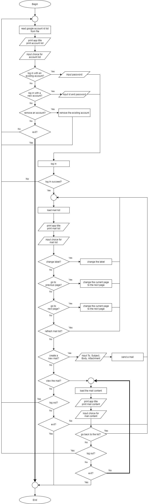

<h1 align="center"> Gmail Client application
</h1>

# Table of Contents
* [R4 - Source link](#R4---Source-link)
* [R5 - Purpose and scope](#R5---Purpose-and-scope)
* [R6 - Features](#R6---Features)
* [R7 - User interaction and experience](#R7---User-interaction-and-experience)
* [R8 - Control flow](#R8---Control-flow)
* [R9 - Implementation plan]


<br /><br />

# R4 - Source link
Source code is in https://github.com/jasonkim7288/JasonKim_T1A2<br /><br />

[Go back](#table-of-contents)<br /><br /><br />

# R5 - Purpose and scope
Gmail client application will manage your Gmail account, show the email list after logged in, show the content of each email, and also let you create a new email with an file attachment. All those functions can be done with a simple command-line interface (CLI).<br />
Users can access their Gmail accounts and check the email without any browser and even send a simple email with a file attached. It will be a good idea to use this Gmail client application if you are a computer server manager which has only command line UNIX environment or if your browser has been infected by any serious virus so you cannot use it.<br />
Once a simple security setting is changed, it is free to access Gmail anytime on command prompt.<br />

[Go back](#table-of-contents)<br /><br /><br />

# R6 - Features
## Manage Gmail account
Gmail client application is able to manage the Gmail account. Once you log in with your existing Gmail account, the application automatically store the account name into a file and show the account name list after next log-in.<br />
If the account you logged in is not supposed to be stored, there is a command for deleting the account which is just removing the account name from the local file not removing the real Gmail account from the server.<br /> 

## Display email list
Once Gmail client application succeeds in log-in, it will display the current account name logged in, the current label of the mailbox, an email list, and the current page of the mailbox.<br />
Every label is from Gmail server, so you can see the exact same label from browser, and default label of the mailbox is "INBOX". Each labeled mailbox has an email list showing email number, sender, subject and a little bit of body.<br />
You can navigate each label of the mailbox and the pages if there are more than 7 mails in the mailbox. If there is an email that interests you, "View the mail" will display the detailed content.<br />

## Create a new email
On the mail list screen, there is an option for creating a new email that allow you to send a simple email to anyone.<br />
Once whom to send, and what the subject is have been submitted, message body part can be written with a html format. You can still use only text except writing "\<br />" to make a new line ('Enter' key is not working).<br />
There is also a special function that "File attachment" is available if wanted. The file name has to include exact file path.

[Go back](#table-of-contents)<br /><br /><br />

# R7 - User interaction and experience
## Playing instructions
1. Change your working directory to: JasonKim_T1A2 -> lib
2. Enter ruby gmail.rb
3. When started, select the menu as below


## Installation
1. If you don't already have Ruby installed, you can download it from and follow the installation instructions available [here](https://www.ruby-lang.org/en/documentation/installation/).
2. Download and uncompress the game files in their existing file structure.
3. Install Ruby Bundler if you haven't already. 3.5) Run bundle install
4. Change your working directory the now unzipped 'Main' folder.
5. Run ruby run_game.rb in the command line to access and execute the game initializing ruby file.

[Go back](#table-of-contents)<br /><br /><br />

# R8 - Control flow
## Flowchart

## Pseudo code
```
Begin
    loop1:
        read google account id list from file
        print app title
        print account list
        input choice for account list
        if select "log in with an existing account"
            input password
        else if select "log in with a new account"
            input id
            input password
        else if select "remove an account"
            remove the existing account
            goto loop1
        else if select "exit"
            exit
        else
            goto loop1
        end if

        log in
        if is log in succeed
    loop2:
            load mail list
        else
            goto loop1
            print app title
            print mail list
            input choice for mail list
            if select "change label"
                change the label
        end if
    

End
```

[Go back](#table-of-contents)<br /><br /><br />

# R9 - Implementation plan

Trallo needed

[Go back](#table-of-contents)<br /><br /><br />

